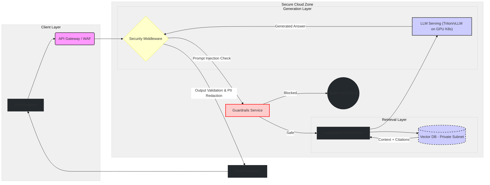

<!-- GitHub Profile · Adrián Infantes · Story/Impact Edition (EN) -->

<!-- HERO · Dark/Light aware -->

  <picture>
    <source media="(prefers-color-scheme: dark)" srcset="./assets/hero-dark.png">
    <source media="(prefers-color-scheme: light)" srcset="./assets/hero-light.png">
    
  </picture>

<h1 align="center">Adrián Infantes</h1>

  

  <em>Architecting secure, scalable, and production-grade AI systems on the Cloud.</em> 
   
  
  
  

---

> 🛰️ **I design, attack and defend AI systems in regulated environments.**  
> - **Who:** AI/ML engineer focused on AI Security & Cloud Architecture in banking/FinCrime.  
> - **What:** Build & harden LLM/RAG platforms on Kubernetes + AWS, with real SLAs and audits.  
> - **Proof:** Zero-Trust LLM stack @BBVA, multi-tenant RAG, measurable lifts in risk & fraud models.

---

## 🎯 Summary

I don't just build AI models; I engineer the **secure cloud ecosystems** that enable them to run in production.

My focus sits at the intersection of **Generative AI**, **Cloud Engineering**, and **Cybersecurity**. I bridge the gap between cutting-edge LLM capabilities (RAG, Agents) and the rigorous demands of enterprise environments (Banking/FinTech). My mission is to deploy systems that are not only intelligent but also resilient, auditable, and hardened against adversarial threats.

---

## 🧠 Core Technical Strengths

* **AI & Cloud Architecture:** `K8s Autoscale` `Multi-tenant GPU Serving` `Serverless AI` `Hybrid Cloud` `Terraform IaC`
* **AI Security & Hardening:** `LLM Red Teaming` `Prompt Guardrails` `PII Redaction Pipelines` `OWASP LLM Top 10` `Model Governance`
* **Generative AI Core:** `Production RAG` `Agentic Systems (LangGraph)` `Fine-tuning (QLoRA)` `DSPy Robust Prompting`

---

## ⚡ Impact at a Glance

| Company      | Role                        | Focus                                 | Key Impact |
|-------------|-----------------------------|---------------------------------------|-----------|
| **BBVA**        | AI/ML Engineer (Senior)     | Secure LLM/RAG platform, FinCrime AI  | Zero-Trust LLM stack, +22% AUC credit-risk, 500k+ guarded queries/month |
| **Ecoembes**    | ML Engineer (Mid)           | Edge CV + Conversational AI           | 89% intent acc., 85% waste classification, −25% logistics km |
| **Capgemini**   | Data Scientist (Junior)     | Data lake, forecasting, BI            | +20% forecast accuracy, −30% analysis cycle time, 10h/analyst/week saved |

---

## 💼 Experience (what I used, why I used it, and what it achieved)

### BBVA — AI/ML Engineer (Senior) · 2024 → Present

**Context**: Architecting secure, multi-tenant LLM platforms for banking. RAG over highly sensitive internal sources with enterprise-grade compliance.

* **The "Why" (Architectural Decisions):**
  * Moved beyond basic RAG to build **verifiable, grounded systems** with re-ranking, crucial for financial data integrity.
  * Engineered **hardened LLM platforms** adopting a "Defense in Depth" approach against prompt injection and context exfiltration.
  * Delivered **cost-efficient GPU compute** via Kubernetes (HPA) and Triton/vLLM, balancing performance with FinOps.

* **The Impact (Metrics):**
  * 🛡️ **Zero Trust AI**: Implemented guardrails processing **>500k queries/month** with 99.95% SLA.
  * ⚡ **Cloud Efficiency**: **−20%** latency via GPU quantization; **p95 < 300 ms** on secure infrastructure.
  * 📈 **Business Value**: **+15%** accuracy on financial analysis tasks & **+22%** AUC-ROC on credit-risk cases.

<h3 align="center">⚡ Visualizing a Secure RAG Architecture (Conceptual)</h3>

Isolating ingestion, retrieval, and generation layers with security boundaries.

<!-- BBVA image -->

  

---

### Ecoembes — Machine Learning Engineer (Mid) · 2020 → 2024

**Context**: Hybrid Cloud & Edge AI. Conversational AI 2.0 and computer vision on the edge for recycling logistics.

* **The "Why" (Architectural Decisions):**
  * Designed a **hybrid architecture (Cloud + Edge)** to run heavy Computer Vision models locally on industrial cameras with cloud synchronization.
  * Migrated legacy chatbots to end-to-end BERT pipelines on containerized infrastructure.

* **The Impact (Metrics):**
  * **89%** intent accuracy (**+40%** lift) on conversational AI.
  * **85%** accuracy in edge-based waste classification.
  * **−25%** logistics kilometers driven via large-scale optimization backend.

<!-- Ecoembes image -->

  

---

### Capgemini — Data Scientist (Junior) · 2017 → 2020

**Context**: Analytics and ML for enterprise clients; data lake build-out, forecasting, and executive BI.

- **Technologies**
  - **ML/Stats**: scikit-learn, statsmodels, XGBoost; pandas/numpy
  - **Data**: Python ETL, SQL/SQLAlchemy; normalization, query tuning
  - **BI**: Tableau, Looker Studio; automated reporting

- **Why I used it**
  - Unify **10+ sources** into a data lake with reproducible ETL and data quality checks.
  - Train **forecasting and scoring** models with traceability/versioning.
  - Democratize **KPIs** via executive dashboards and parameterized reporting.

- **What it achieved (metrics)**
  - **+20%** forecasting accuracy on product adoption.
  - **−35%** SQL response times and **−30%** monthly analysis cycle.
  - Saved **10 h/analyst/week** through report automation.

<!-- Capgemini image -->

  

---

## 📊 What I Monitor in Production (The Architect's Dashboard)

1. **Security & Risk:** Prompt injection attempts blocked, PII leakage detection rate, adversarial drift.
2. **Reliability & SLOs:** p95/p99 latency against targets, GPU saturation vs throughput, error budgets.
3. **RAG Quality:** Groundedness score (hallucination check), retrieval precision/recall, citation accuracy.

---

## 🧱 Secure AI & Cloud Stack

  
<b>🚀 Cloud, MLOps & Observability</b>

   

| Category | Technologies |
|---|---|
| **Cloud** | AWS (core), Azure (multi-cloud strategy) |
| **Compute** | Amazon EKS, EC2 (g5/p4 instances), Lambda, GPU K8s clusters |
| **IaC & DevOps** | Terraform, GitHub Actions, AWS CDK |
| **MLOps & Obs.** | Amazon SageMaker Pipelines, MLflow, Prometheus, Grafana, OpenTelemetry, Evidently AI |

 

  
<b>🛡️ AI Security & Governance</b>

   

| Category | Technologies |
|---|---|
| **LLM AppSec** | Prompt Guardrails, custom LangChain security middleware, threat modeling |
| **Red Teaming** | Adversarial ML evaluation, jailbreak test-suites, policy fuzzing |
| **Compliance** | PII masking pipelines, audit trails, AWS KMS, IAM hardening, WAF, policy enforcement |

 

  
<b>🧠 GenAI & Data</b>

   

| Category | Technologies |
|---|---|
| **Models** | GPT-4o, LLaMA-3, Mistral (Fine-tuning with QLoRA) |
| **Orchestration** | LangChain, LangGraph (Agentic flows), DSPy, Amazon Bedrock Agents |
| **RAG Stack** | Pinecone, Amazon OpenSearch Vector Engine, hybrid search + cross-encoder re-ranking, Bedrock Knowledge Bases |
| **Data Eng** | Python, SQL, PySpark, data lakes / lakehouse architectures |

---

## 📈 GitHub Stats

  
  

---

## 🔧 Toolkit (Quick View)

  
  
  
  
  
  
  

---

## 🧭 Education & Academic Path

* **BEng (Hons) Software Engineering with Cybersecurity** (Ongoing) — Edinburgh Napier University. *Focus on secure coding and systems defense.*
* **Master in GenAI & Deep Learning** (2020–2021) — MIOTI.
* **Master in Big Data & Data Science** (2023–2024) — MIOTI.
* **B.Sc. in Software Engineering** (UCJC).

---

## 🏅 Certifications (Cloud & AI Focus)

* **AWS Certified Solutions Architect – Associate** (SAA-C03)
* **AWS Certified Machine Learning Engineer - Associate** (MLA-C01) *[Target 2025]*
* **NVIDIA Certified Associate** — AI in the Data Center
* **DeepLearning.AI** — Generative AI with LLMs
* **LangChain Academy** — Introduction to LangGraph
* **ISC2** — Certified in Cybersecurity (CC)

---

## 🗺️ Immediate Roadmap

- **Shift-left Security:** Integrating LLM Red Teaming into CI/CD pipelines.
- **Agentic Scale:** Deploying multi-agent systems on EKS with zero-trust networking.
- **Hardware Optimization:** Deep dive into AWS Trainium/Inferentia for cost reduction.

---

## 🧪 Featured Repositories

> Update the links once the repos are public. These are meant as *proofs*, not just code dumps.

| Repo | What it proves | Link |
|------|----------------|------|
| **banking-secure-rag-platform** | End-to-end secure RAG on K8s with guardrails, audit logging and FinCrime use cases. | [`github.com/infantesromeroadrian/banking-secure-rag-platform`](https://github.com/infantesromeroadrian/banking-secure-rag-platform) |
| **ai-red-teaming-toolkit** | Adversarial ML & jailbreak harness for LLM apps with reporting. | [`github.com/infantesromeroadrian/ai-red-teaming-toolkit`](https://github.com/infantesromeroadrian/ai-red-teaming-toolkit) |
| **jarvis-local-assistant** | Local-first AI assistant (LLM + voice) orchestrated via LangGraph/Ollama. | [`github.com/infantesromeroadrian/jarvis-local-assistant`](https://github.com/infantesromeroadrian/jarvis-local-assistant) |
| **fraud-graph-analytics-lab** | Graph-based fraud detection + LLM copilot flows for analysts. | [`github.com/infantesromeroadrian/fraud-graph-analytics-lab`](https://github.com/infantesromeroadrian/fraud-graph-analytics-lab) |

---

## 🧾 For Hiring Managers & CTOs

- **Roles I fit best:** AI Solutions Architect · AI Security Engineer · Cloud AI Engineer (K8s + LLMs).  
- **Domains where I’m strongest:** Banking, Financial Crime Prevention, regulated environments.  
- **What I actually enjoy:** designing, attacking and hardening LLM/RAG systems in production, not just PoCs.  
- **Location / Work mode:** Based in Spain, open to EU/UK-remote; English/Spanish working proficiency.

---

## 🤝 Collaboration Scope

I'm looking to collaborate on projects designed for production, not just PoCs. Let's connect if you are building:

* Secure, multi-agent systems on Kubernetes.
* Financial grade RAG with strict compliance requirements.
* AI Red Teaming exercises and hardening strategies.

  <a href="mailto:infantesromeroadrian@gmail.com">infantesromeroadrian@gmail.com</a> · <a href="https://www.linkedin.com/in/adrianinfantes">LinkedIn</a>

